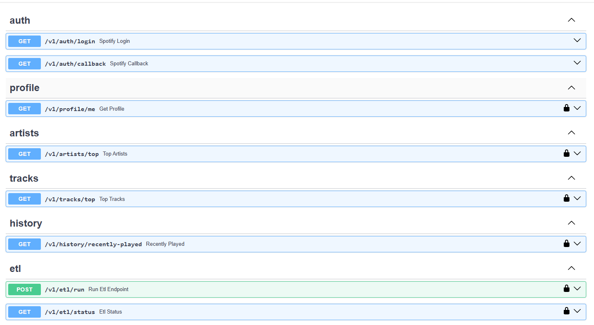
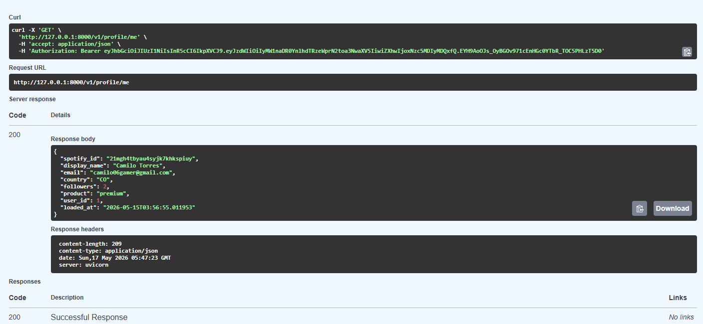
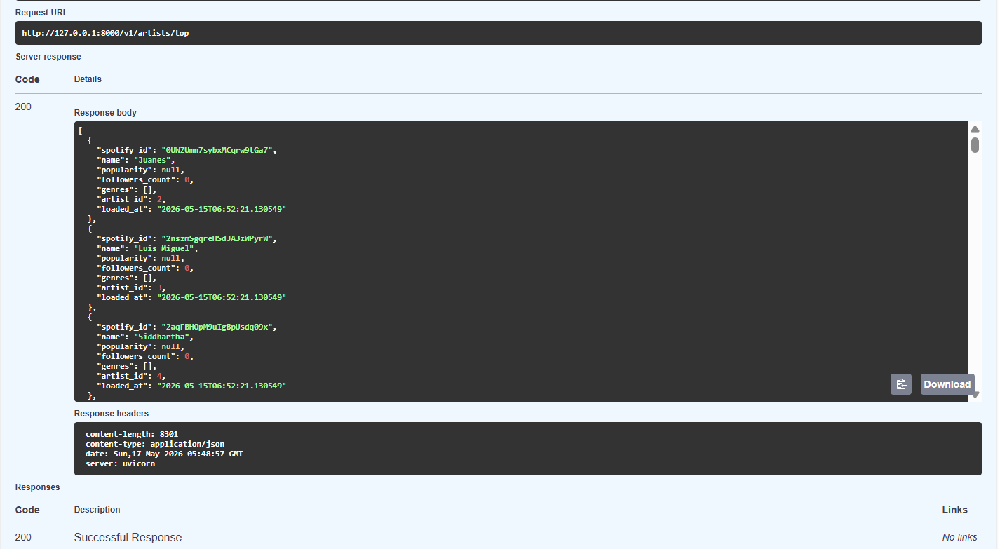

# Backend Implementation

## Qué se implementó

Backend completo con FastAPI siguiendo arquitectura en capas:
routers → services → database. Autenticación exclusivamente vía
Spotify OAuth PKCE. Todas las rutas protegidas con JWT firmado
por la app.

---

## Arquitectura

```
backend/
├── main.py                  ← FastAPI app, CORS, routers
└── app/
    ├── core/
    │   ├── config.py         ← Variables de entorno (Pydantic Settings)
    │   ├── database.py       ← Conexión psycopg2 a Neon
    │   ├── security.py       ← Dependency get_current_user (JWT)
    │   └── spotify_client.py ← Cliente HTTP reutilizable para Spotify
    │
    └── v1/
        ├── api.py            ← Agrupa todos los routers
        ├── routers/          ← Endpoints HTTP
        ├── services/         ← Lógica de negocio y ETL
        └── schemas/          ← Modelos Pydantic (Base/Request/Response)
```

---

## Endpoints implementados

| Método | Ruta | Protegida | Descripción |
|---|---|---|---|
| GET | `/v1/auth/login` | No | Inicia flujo PKCE con Spotify |
| GET | `/v1/auth/callback` | No | Recibe code, emite JWT |
| GET | `/v1/profile/me` | Sí | Perfil del usuario autenticado |
| GET | `/v1/artists/top` | Sí | Top artistas filtrados por usuario |
| GET | `/v1/tracks/top` | Sí | Top tracks filtrados por usuario |
| GET | `/v1/history/recently-played` | Sí | Historial de reproducciones |
| POST | `/v1/etl/run` | Sí | Ejecuta el pipeline ETL completo |
| GET | `/v1/etl/status` | Sí | Estado del DWH y últimas ejecuciones |

---

## Flujo de autenticación PKCE

1. GET /v1/auth/login
→ genera code_verifier, code_challenge, state 
→ guarda {state: verifier} en public.pkce_sessions
→ redirige a accounts.spotify.com/authorize
2. Spotify redirige a GET /v1/auth/callback?code=...&state=...
→ valida state en pkce_sessions
→ intercambia code por access_token y refresh_token
→ UPSERT en dwh.dim_users
→ emite JWT {sub: spotify_id, exp: now+8h}
→ redirige a FRONTEND_URL/callback?token=JWT
3. Requests posteriores
→ Authorization: Bearer JWT
→ get_current_user decodifica JWT y extrae spotify_id

---

## Convenciones aplicadas

- **Regla 1:** Schemas con sufijos Base / Request / Response
- **Regla 3:** Docstring de funciones con Args y Returns
- **Regla 4:** Docstring de archivo en cada .py
- **Regla 5:** Todas las rutas de datos protegidas con get_current_user
- **Regla 6:** Autenticación exclusivamente vía Spotify PKCE
- **Regla 7:** Todas las rutas bajo prefijo /v1

---

## Screenshots

### Swagger con todos los endpoints


### Respuesta de GET /v1/profile/me


### Respuesta de GET /v1/artists/top


---

## Prompt utilizado

[Prompt exacto si usaste IA, o "No se utilizó ninguna técnica de IA."]

## Técnica de prompting aplicada

[Técnica usada o "No aplica."]

