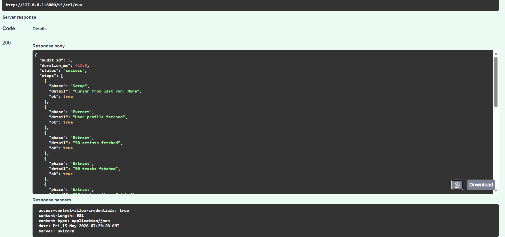
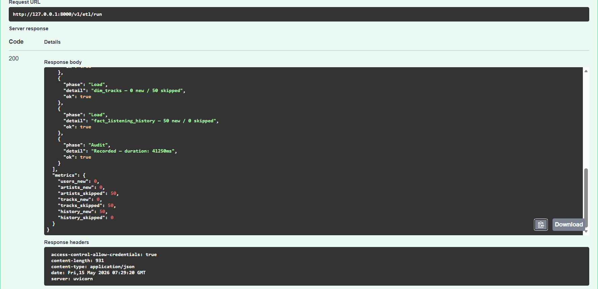
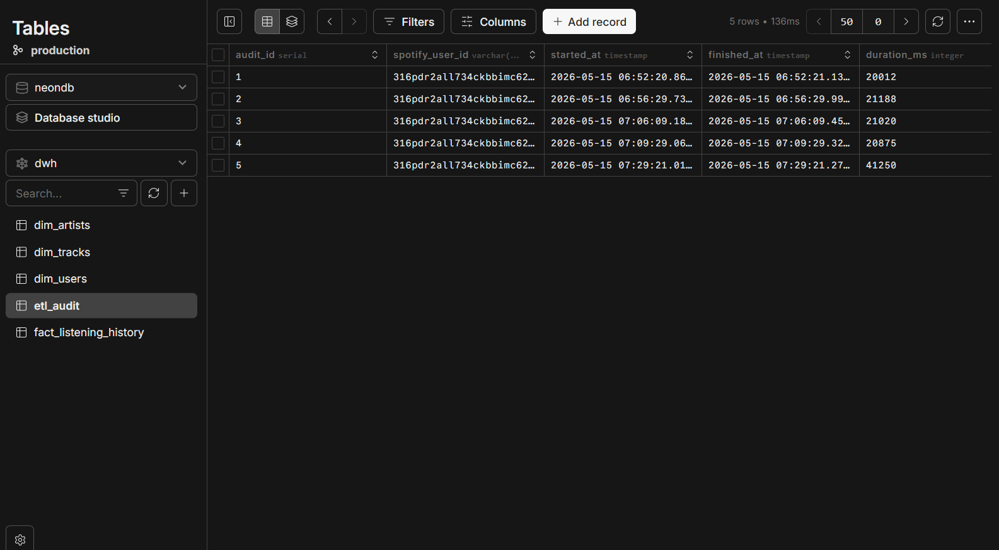
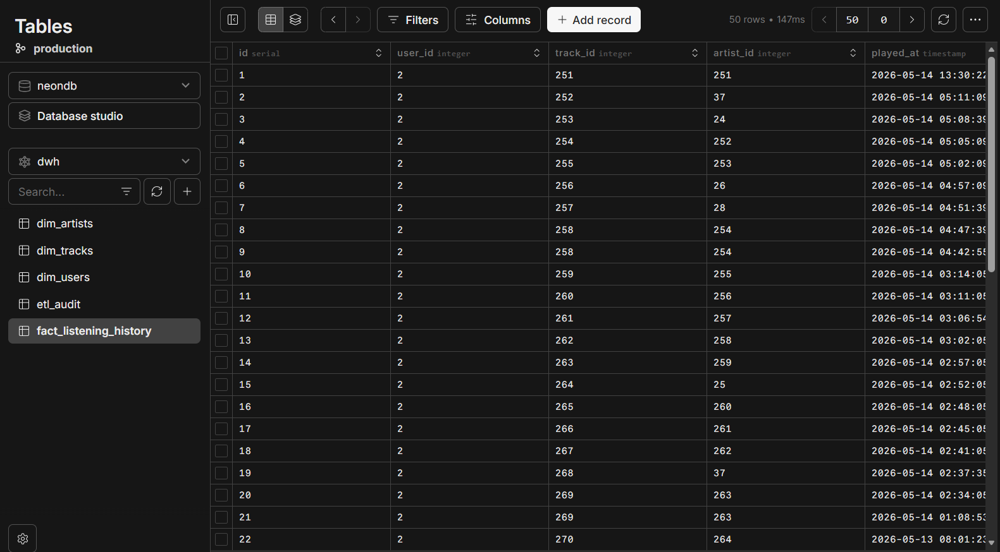

# ETL Pipeline

## Qué se implementó

Pipeline ETL completo con tres fases separadas para los cuatro endpoints
de Spotify. Cada fase tiene funciones independientes con docstrings completos.
La auditoría registra cada ejecución en `dwh.etl_audit` con métricas y cursor
incremental para la próxima carga.

---

## Fase 1 — Extract

Cuatro funciones que llaman a la Spotify Web API y retornan JSON crudo
sin ninguna transformación:

| Función | Endpoint Spotify | Destino |
|---|---|---|
| `extract_user` | `GET /v1/me` | `dim_users` |
| `extract_top_artists` | `GET /v1/me/top/artists` | `dim_artists` |
| `extract_top_tracks` | `GET /v1/me/top/tracks` | `dim_tracks` |
| `extract_recently_played` | `GET /v1/me/player/recently-played` | `fact_listening_history` |

---

## Fase 2 — Transform

Cuatro funciones que normalizan los datos crudos para el modelo dimensional:

- `played_at`: ISO 8601 con `Z` → `datetime` con timezone UTC
- `hour_of_day`: extraído de `played_at.hour`
- `day_of_week`: extraído de `played_at.strftime("%A")`
- `genres`: ya viene como `list[str]`, se guarda como `TEXT[]`
- `context_type`: `item.get("context") or {}).get("type") or "unknown"`

---

## Fase 3 — Load

Cuatro funciones que insertan en PostgreSQL con idempotencia:

```sql
INSERT INTO dwh.dim_artists (...)
VALUES (...)
ON CONFLICT (spotify_id) DO NOTHING;
```

`load_history` también inserta artistas y tracks faltantes antes de
cargar `fact_listening_history`, garantizando que todas las FK se resuelven.

---

## Carga incremental

El ETL lee `cursor_next_ms` de la última ejecución exitosa en `etl_audit`
antes de llamar a `recently-played`. En la primera carga no se pasa
parámetro `after`. En ejecuciones posteriores se pasa `after=cursor_next_ms`.

```python
cursor_after_ms = get_last_cursor(conn, spotify_user_id)
# Primera carga: cursor_after_ms = None → sin parámetro after
# Siguientes:    cursor_after_ms = 1234567890000 → after=1234567890000
```

---

## Renovación de access token

Antes de cada ejecución del ETL se verifica `token_expires_at` en
`dim_users`. Si expira en menos de 5 minutos se llama al endpoint
de refresh de Spotify y se actualiza la tabla.

---

## Auditoría — etl_audit

Cada ejecución registra:

| Campo | Descripción |
|---|---|
| `started_at` | Inicio de la ejecución |
| `finished_at` | Fin de la ejecución |
| `duration_ms` | Duración total en milisegundos |
| `status` | `success` o `error` |
| `*_new` | Registros nuevos por tabla |
| `*_skipped` | Registros ya existentes (ON CONFLICT) |
| `cursor_next_ms` | MAX(played_at) en Unix ms para la próxima carga |

---

## Screenshots

### Ejecución exitosa del ETL en Swagger



### Registro en etl_audit en Neon


### Registros en fact_listening_history


---

## Prompt utilizado

[Si usaste IA para generar alguna parte del ETL, pega el prompt exacto aquí.
Si no usaste IA: "No se utilizó ninguna técnica de IA."]

## Técnica de prompting aplicada

[Nombre de la técnica: zero-shot, few-shot, chain-of-thought, role prompting.
Si no aplica: "No aplica."]