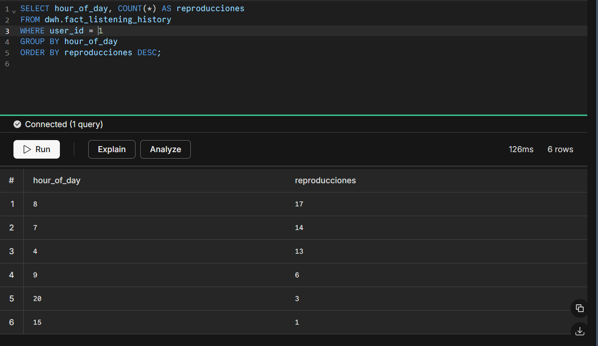
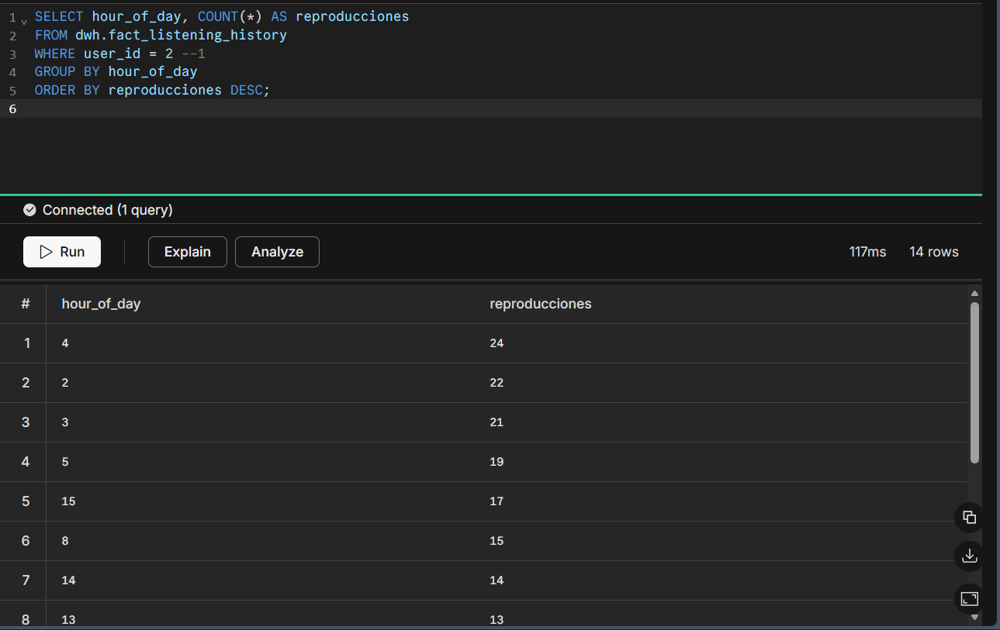
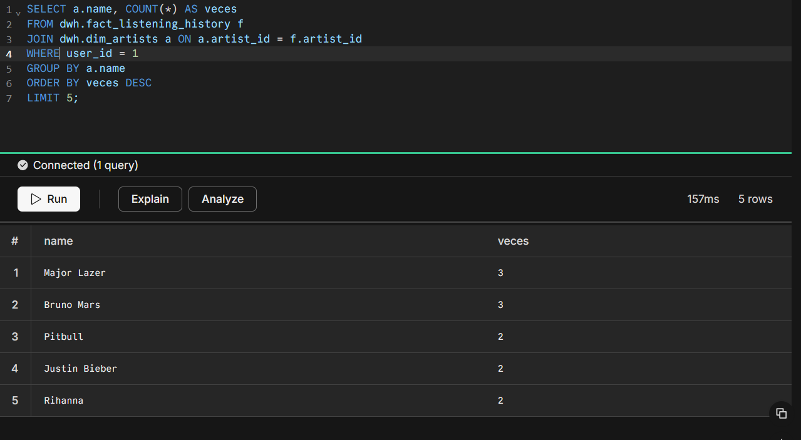
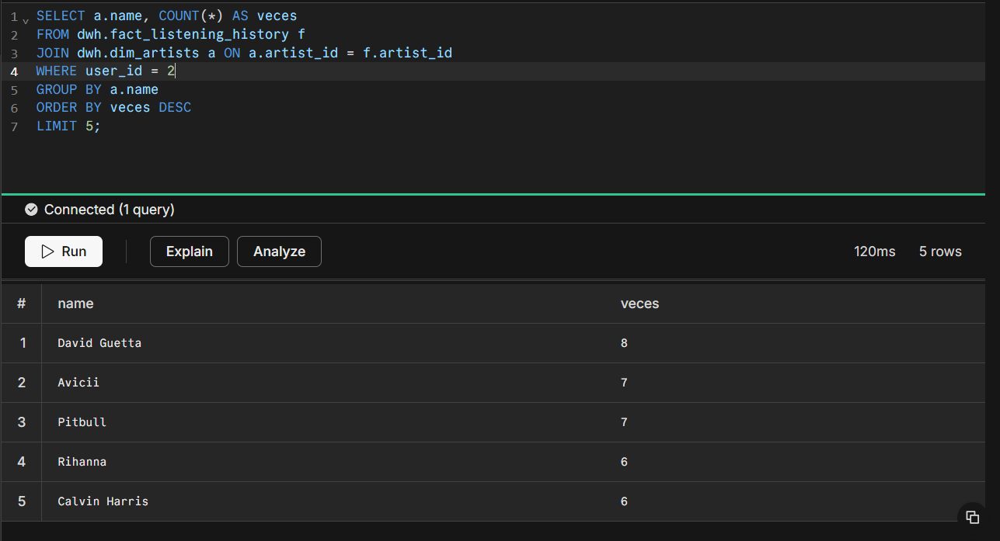
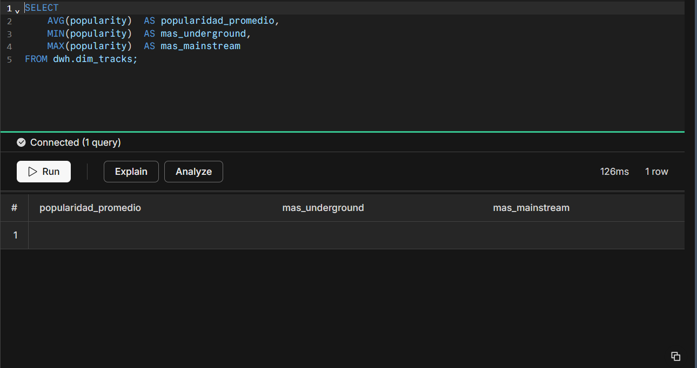
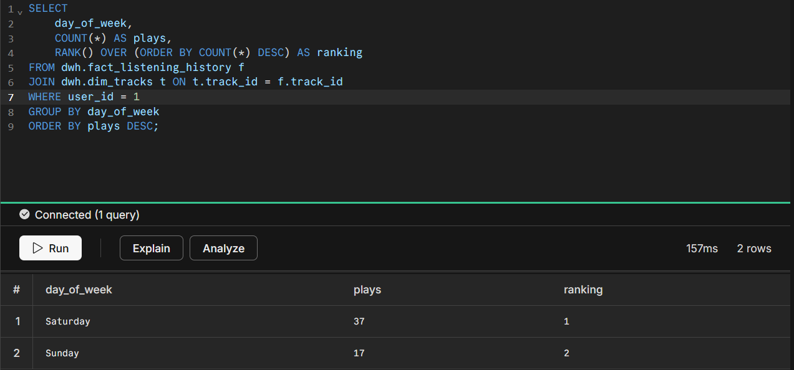
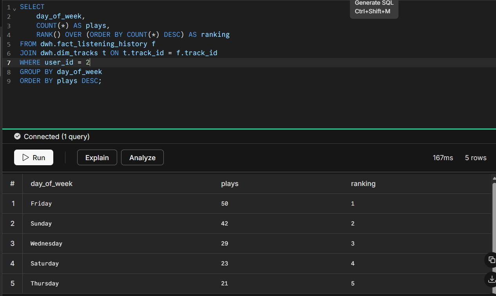

# Analytical Queries

## Qué se implementó

Cinco consultas SQL analíticas ejecutadas directamente sobre el DWH
en Neon. Cada query responde una pregunta de negocio sobre los hábitos
de escucha del usuario.

---

## Query 1 — ¿En qué hora del día escuchas más música?

```sql
SELECT hour_of_day, COUNT(*) AS reproducciones
FROM dwh.fact_listening_history
WHERE user_id = 2 --1 
GROUP BY hour_of_day
ORDER BY reproducciones DESC;
```

### Resultado





### Interpretación

[Escribe aquí qué hora tiene más reproducciones y qué crees que estabas
haciendo en ese momento — estudiar, transportarte, descansar, etc.]

* User1: Mi hora peak es a las 8am y en ese momento puedo estar preparando mi desayuno.

* User2: Mi hora peak es a las 4am y a esa hora podria tanto estar haciendo tareas o durmiendo.
---

## Query 2 — ¿Cuál es tu artista más escuchado recientemente?

```sql
SELECT a.name, COUNT(*) AS veces
FROM dwh.fact_listening_history f
JOIN dwh.dim_artists a ON a.artist_id = f.artist_id
GROUP BY a.name
ORDER BY veces DESC
LIMIT 5;
```

### Resultado

[Pegar screenshot del resultado en Neon]




### Interpretación

[Escribe aquí quién es tu artista más escuchado y si te sorprendió
o era lo esperado.]

* user1: Mi artista mas escuchado es Major Lazer, si me sorprendió, creí que seria Bruno Mars.

* user2: Mi artista mas escuchado es David Guetta y no me sorprende.

---

## Query 3 — ¿Qué tan popular es tu música?

```sql
SELECT
    AVG(popularity)  AS popularidad_promedio,
    MIN(popularity)  AS mas_underground,
    MAX(popularity)  AS mas_mainstream
FROM dwh.dim_tracks;
```

### Resultado



### Interpretación

* No se obtubieron datos porque los endpoint de spotify usados no devielven esa info

---

## Query 4 — ¿Cuáles géneros dominan tu biblioteca?

```sql
SELECT UNNEST(genres) AS genero, COUNT(*) AS artistas
FROM dwh.dim_artists
GROUP BY genero
ORDER BY artistas DESC
LIMIT 10;
```

### Resultado

[Pegar screenshot del resultado en Neon]

### Interpretación

* El sistema no guarda los generos de los tracks, por ende no tenemos resultado de query

---

## Query 5 — Ranking de día de la semana con mas canciones escuchadas

```sql
SELECT
    day_of_week,
    COUNT(*) AS plays,
    RANK() OVER (ORDER BY COUNT(*) DESC) AS ranking
FROM dwh.fact_listening_history f
JOIN dwh.dim_tracks t ON t.track_id = f.track_id
WHERE user_id = 2 --1
GROUP BY day_of_week
ORDER BY plays DESC;
```

### Resultado





### Interpretación

* user1: 
* user2: mi dia mas activo fue el viernes y creo que pudo ser porque pase gran parte del dia haciendo tareas mientras escuchaba música


## Prompt utilizado

No se utilizó ninguna técnica de IA.

## Técnica de prompting aplicada

No aplica.